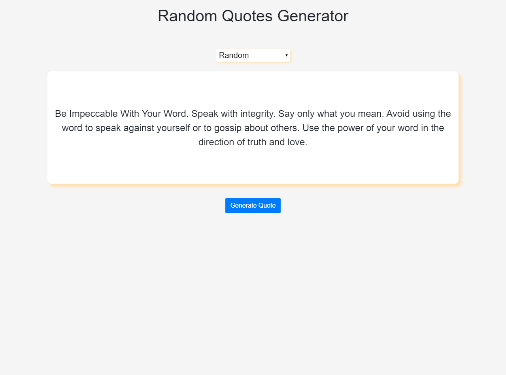
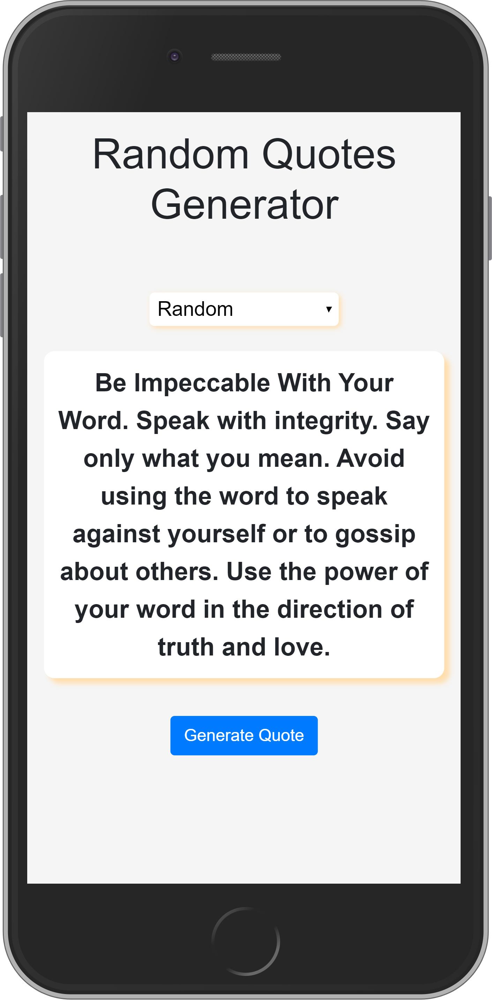

# random_quote_generator
A random quote generator - DevTask 3

This is the third project in the DevTask project series. The app is a simple random quotes generator with the ability to choose from eight (8) different quote categories. There is also a random category as well.

An API was used in getting the quotes and it can be found here courtesy of [LukePeavey](https://github.com/lukePeavey/quotable). Everything was done with vanilla js, html and css; no framework was used in the project

## Screenshots

Desktop

Mobile

## Live Demo

[Hosted Link](tamsay-random-quote-generator.netlify.app)

## Author

Longe Temitope
- Github: [@tamsay](https://github.com/tamsay)
- Twitter: [@longetope](https://twitter.com/longetope)

## 🤝 Contributing

Contributions, issues and feature requests are welcome!

Feel free to check the [issues page](https://github.com/tamsay/random_quote_generator/issues)

## Show your support

Give a ⭐️ if you like this project!

## Acknowledgments

Project inspired by [saucecode.xyz](https://saucecode.xyz/t/devtask-3-building-a-random-quote-generator-frontend/211)
